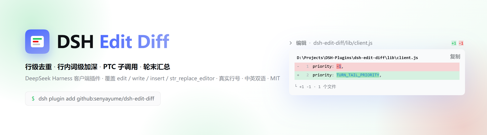
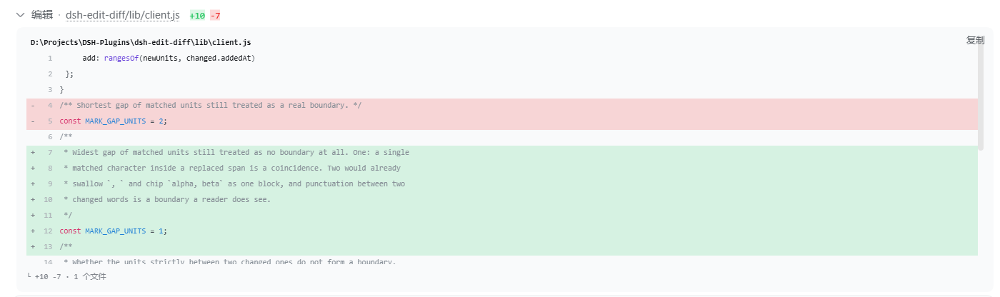
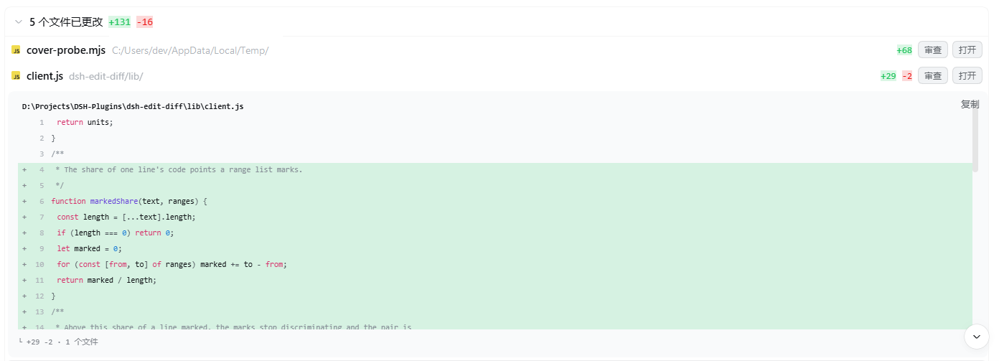
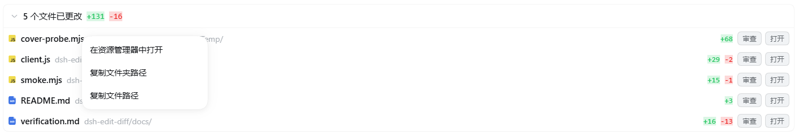
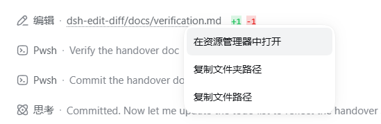

# dsh-edit-diff

中文 | [English](README.en.md)

<p align="center">
  <picture>
    <source media="(prefers-color-scheme: dark)" srcset="assets/banner-dark.png">
    
  </picture>
</p>

[](LICENSE)

[](https://github.com/senyayume/dsh-edit-diff/stargazers)

DSH 客户端插件：文件变更工具的卡片上显示 `+N -M` 分色统计，展开后是**一行只出现一次**的差异体——
相同行作为暗色上下文，改动行红/绿分色，行内真正改动的字符再加下划线加粗。`run_code`（PTC）里的
子调用与 `str_replace_editor` 同样接管。

轮末再给本轮改过的文件一张汇总卡：标题「N 个文件已更改」+ 合计 `+A -R`，头部一点整卡折叠；逐文件
一行是文件类型图标、文件名（主色）、所在目录（暗色）、`+N -M`，行尾「审查」「打开」，展开是同一套差异体。

**右键任意一行**（轮末卡的每一行，以及上面那些工具行）都有「在资源管理器中打开」/「复制文件夹路径」/
「复制文件路径」；前者由插件自己的宿主路由完成（Windows 走 `explorer.exe /n,/select,…`），不依赖其它宿主接口。

**特性一览**

- **行级去重 + 背景高亮**：相同上下文行只渲染一次；改动行用**整行红/绿底色**标出（不是把文字染色），行内真正改动的字符是同一底色再深一档；文字本身走**语法着色**，用的是插件自带的本地分词器 + 主题的 `--shiki-token-*` 变量（与内置代码块同一套配色，见下面「语法着色与背景高亮」）。内置 diff 会把相同行在红绿两区各渲染一遍。
- **覆盖四种工具行 + PTC 子调用**：`edit` / `write` / `insert` / `str_replace_editor`，以及 `run_code`（PTC）里的子调用；内置 `diffCardModel` 对这两类直接返回 null。
- **轮末改动卡**：这一轮改了哪些文件、各自 `+N -M` 与合计，整卡可折叠，行尾「审查」「打开」，展开是同一套差异体。
- **右键路径菜单**：轮末卡与工具行都能「在资源管理器中打开」/「复制文件夹路径」/「复制文件路径」，由插件自己的宿主路由完成，官方 opener 作回落。
- **中英双语文案**，路径按会话 workspace 相对化（workspace 之外原样显示绝对路径）。

[它长什么样](#它长什么样) · [快速上手](#快速上手) · [为什么需要它](#为什么需要它) · [语法着色与背景高亮](#语法着色与背景高亮) · [轮末改动卡](#轮末改动卡) · [已知限制](#已知限制以及为什么不做) · [已知契约](#已知契约照本机-shipped-代码核对过) · [结构](#结构)

## 它长什么样



工具行：标题行右侧是 `+N -M` 分色统计，展开后是同一套对齐差异体——相同行只出现一次（暗色上下文），
改动行整行红/绿底色，行内真正改动的字符再深一档，文字本身走语法着色。



轮末改动卡：逐文件一行（类型图标 / 文件名 / 目录 / `+N -M` / 审查 / 打开），点「审查」就地展开同一套差异体。





右键任意一行——轮末卡的每一行，以及本插件接管的工具行——都有「在资源管理器中打开」/
「复制文件夹路径」/「复制文件路径」。

> 这几张是**本机实机截图**（亮色主题，DSH Desktop 自带 harness）。截图里那两张差异体的行号是
> **窗口内相对编号**（host 半身未随进程装载时的 fallback），不是文件真实行号——真实行号的形态见
> 「已知限制」一节：删除行读旧侧、新增与上下文行读新侧。
>
> **顶部那张横幅不是截图**：它是用**真实主题样式表 + 真实插件样式表**、把真实 `bodyRows` 的输出
> 渲进 headless 浏览器生成的（深色版走 `prefers-color-scheme`）。所以它不会跟真实设计漂移，但它
> 证明的是「版式长这样」，**不是**「插件真跑起来是这样」——后者靠上面四张实机截图。
> 横幅里那张卡是 **PTC 子调用的形状**（结果块没有 `meta`，hunk 由调用参数推导），所以行号是
> 相对编号；它的改动取自本仓真实提交 `9a6c36d`（`priority: -1,` → `priority: TURN_TAIL_PRIORITY,`）。

## 快速上手

### 系统要求

- **DSH**：开发与实测环境是 DSH Desktop 自带 harness `0.1.5-rc.2`（`@deepseek-ai/dsh-client-ui-primitives` 同版本），宿主路由的注册另在 CLI harness `0.1.1` 上验过。更低的版本没测：若那个版本没有 `uiConversation.events` 与 `conversation.chat.turnTail` 槽位，插件会安静降级成「只接管工具行、不出轮末卡」（`lib/client.js` 里就是这么分支的）。
- **Node**：安装由 `dsh plugin add`（内部 pnpm）完成；跑本仓测试需要 Node ≥ 18 与 React 18（`npm install` 会装，也可用 DSH 自带那份，见「验证」）。
- **平台**：「在资源管理器中打开」在 Windows 11 实测（`explorer.exe /n,/select,…`）；macOS 走 `open -R`、Linux 走 `xdg-open <目录>`——代码在，但**未在真机验证**。

### 安装

这是一个标准 DSH bundle：`package.json` 声明了 `dsh.bundle.patch` → `cordis.patch.yml`，装上即挂载，
不需要手工改 profile。

```bash
# 内部就是 pnpm add，所以 github: 写法可用；profile 名按你要装进去的那个填
dsh plugin add github:senyayume/dsh-edit-diff --profile desktop
```

**生效方式分两半（踩过坑，写在这里）**：

- **客户端半身**（`lib/client.js`）：每次页面加载都从磁盘取，**刷新窗口就够**（所以文案类改动看起来立刻生效）；
- **host 半身**（`lib/index.js`）：**只在 harness 进程启动时装载**；而 DSH Desktop **关窗口只是缩到托盘、进程不退**，
  所以动过 host 半身必须**从托盘右键退出再启动**（或在任务管理器里结束所有 `DSH Desktop.exe`）。

  不这么做的典型症状：客户端文案一轮一轮在变，host 那条路由却始终不存在——客户端 POST 打到 harness，
  落到静态前端拿回 **405**（`dsh-host-frontend-static` 对未知路径的非 GET/HEAD 一律 405）。

### 从源码开发（把 junction 挂进 profile）

- 挂载：junction `$DSH_HOME/profiles/<profile>/node_modules/dsh-edit-diff` → 源码目录
- profile `package.json` dependencies 登记 `"dsh-edit-diff": "file:<源码目录>"`
- 若 profile 里没有 `dsh.bundle` 这条通道，再往 `cordis.patch.yml` 追加：

  ```yaml
  - insert:
      - id: edit-diff
        name: dsh-edit-diff
  ```

### 验证与卸载

```bash
npm test                     # = node test/smoke.mjs && node test/host.mjs
node --check lib/client.js
node --check lib/index.js
```

`test/smoke.mjs` 需要 React 18：优先用 DSH 应用自带那份（`DSH_APP_ROOT` 可指向 DSH 应用目录，默认找
`D:/DSH Desktop/resources/app`），找不到就退回 `npm install` 装的那份。

装好后逐条过的 live 清单（工具行 A1–A6、轮末卡 B1–B12、会话装配 C1–C2）与「没过怎么定位」见
[`docs/verification.md`](./docs/verification.md)。

#### 卸载

`dsh plugin remove dsh-edit-diff --profile <profile>`（或删掉 profile `cordis.patch.yml` 里那条 `edit-diff`
insert）并重启 harness，即回到 DSH 内置渲染；只回滚渲染层可以 `git restore lib/client.js` 后刷新窗口。

### 安装排障

<details>
<summary><strong>装完没反应，工具行还是 DSH 内置样式</strong></summary>

1. 确认装进了对的那个 profile：`dsh plugin add github:senyayume/dsh-edit-diff --profile <profile>`；随后 profile 的 `package.json` 里 `dsh.profile.bundles` 应含 `dsh-edit-diff`（本插件自带 `dsh.bundle` → `cordis.patch.yml`，所以装上即挂载，不需要手工加 entry）。
2. 确认**真的重启了 harness**：客户端半身（`lib/client.js`）刷新窗口就够，host 半身（`lib/index.js`）只在进程启动时装载；DSH Desktop 关窗口只是缩到托盘，必须托盘右键退出再启动。

</details>

<details>
<summary><strong>点「在资源管理器中打开」没窗口，或只出现一行字</strong></summary>

那一行下方会写它走的是哪条路：`已请本插件宿主打开资源管理器`（插件自己的宿主路由成功）、`已请求在资源管理器中显示（官方 host 已确认）`（回落到官方 opener，后面还附路由为什么没用上）、或红字原因。
再看宿主日志 `<DSH_HOME>/logs/host/dsh-<日期>.log`：应有 `[dsh-edit-diff] host half loaded` 与 `reveal route mounted at /edit-diff/reveal` 两行——两行都没有，就是 host 半身没装载（回到上一条）。

</details>

<details>
<summary><strong>客户端 POST 拿到 405</strong></summary>

405 来自 `dsh-host-frontend-static`（未知路径的非 GET/HEAD 一律 405），含义是那条宿主路由**没注册**——几乎总是 host 半身没随进程重新装载，而不是插件没装。

</details>

## 为什么需要它

### 1. 有些工具根本不渲染 diff

DSH 内置的 `@deepseek-ai/dsh-client-ui-tool` 里，`diffCardModel()` 有两条硬限制：

```js
if (block.parentCallId !== void 0) return null;            // run_code（PTC）子调用一律不渲染 diff
if (intended.tool === "str_replace_editor") return null;   // 该工具一律不渲染 diff
```

于是：

- 在 PTC 模式下（`run_code` 内部调用 `tools.edit` / `write` / `insert`），编辑条目只剩「编辑 · 路径」一行加结果文本，看不到改了哪几行；
- `str_replace_editor`（非 PTC 会话的编辑工具）即使成功也不显示 diff。

### 2. 内置 DiffBlock 不做行匹配，上下文被渲染两遍

`@deepseek-ai/dsh-client-ui-primitives` 的 `buildRows()` 把 `oldText` 的每一行都画成 `-`、
`newText` 的每一行都画成 `+`，两侧不做行级匹配；而主机侧 `dsh-tool-fs` 的
`computeHunkDiffs()` 用 `context: 3` 生成 hunk，删增两侧都带同样的 3 行上下文。
结果：改 1 行会画出 14 行，其中 7 行是同一句话出现在红区和绿区，统计也变成 `+7 -7`。

本插件不改任何 DSH 安装目录文件，而是通过官方 keyed 槽位 `tool.call.toolview` 以 `priority: -1`
遮蔽内置 `edit` / `write` 行渲染（槽位注册表按 priority 取最低者渲染），额外接管
`insert` 与 `str_replace_editor`。差异体不再复用内置 `DiffBlock`：行内高亮需要每一行的
字符级差异，内置块只接受纯文本行。

## diff 数据来源

1. 结果元数据 `block.meta.diffs`（live 且存在时最准确，含 `replace_all` 的多段 hunk）；
2. 否则从调用参数推导：`write`→`content`，`edit`→`old_string`/`new_string`，
   `insert`→`new_str`，`str_replace_editor`→`create`/`str_replace`/`insert` 命令。

参数在 root 调用、`run_code` 子调用以及会话回放中都存在，因此两条路径都能显示。
子调用结果块（`dsh-client-ui-chat` 的 `childResult`）本身不带 `meta`，会自动落到第 2 条。
**调用失败时（`block.isError`）不推导**：失败的 edit/write 没有应用过的 hunk，参数里的改动根本没落地
（`FS_STALE_VERSION` / `FS_EDIT_NOT_FOUND` 这类），红行只显示失败原因，不会声称 `+N -M`。

## 行级对齐与行内高亮

`lib/client.js` 里这条链是纯函数，可被单独测试：

- `changedLines()`：公共前缀/后缀线性收缩，只对中间差异带跑 Myers（`O(ND)`），返回删/增两侧的**行号**；
- `hunkRows()`：按行号把两侧对齐成 `ctx` / `del` / `add` 行，相同行只出现一次（内置块会在两侧各画一遍）；
- `pairRun()` / `withMarks()`：一个 **run**（连续的一段删除行 + 紧随其后替换它的新增行）的两侧
  按**内容相似度**配对，而不是按位置——顺序保持的最大相似度对齐（零空档罚分的 Needleman-Wunsch），
  相似度是**字符级 Dice**。所以删增行数不等也能标：多出来的那行没有对应者，保持素行即可；
  在 run 顶部插一行也不会让后面每一对错位（按位置配时，标记会落到别的行的文字上）。相似度必须
  **严格大于 0** 才成对——两行一个字符都不共享时，标满两侧本来就会被覆盖率规则丢掉，白算。
  run 超过 `MARK_PAIR_CELLS = 16384`（128×128）时 `pairRun()` 返回 null，**等长**的退回按位置配对
  （也就是改动前的形状），不等长的完全不标——两条都只是退化成旧行为，不会把标记落到错的行上。
  相似度用**字符**而不是 `markUnits` 单元：必须认出来的正是「换了词的同一行」，而
  `registrations` → `tool rows` 的单元交集是空的，按单元算会把这一对判成不相干；
- `charMarks()`：一对替换行做**词级**对齐——两侧先按「词 / 空白 / 单个 CJK 字符或标点」
  切成**单元**（`markUnits()`），对这些单元跑 Myers，再把未对齐的单元换算成码点 `[start, end)` 区间。
  两个改动之间的空档**全是非词字符**（空白 / 标点 / 符号）时并成一块：反引号与空格不承载意义，
  `` `~` 前缀 `` 必须是一块，而不是 `~` + 空档 + `前缀`；空档里只要有**一个词字符**就是有意义的边界
  （`alpha, beta` 的逗号被吞掉，而 `x = 1; y = 2;` 里的 `y` 挡住合并）。
  一行被标记的**比例超过 80%** 时两侧都不标：标记不再有区分力，行底色已经说了「这行变了」，
  再盖一层只会让整张卡发暗。阈值是量出来的——合法的两词替换覆盖 71-73%，而重写段落（两侧只剩标点
  还共享）覆盖 85-97%。
  粒度是词而不是码点，是因为按码点对齐会把被替换的两个词之间**能对齐的公共字符**（`o` / `r` / `t` 一类）
  算成「没变」，剩下的未对齐码点天然不连续——`registrations` → `tool rows` 曾实测成
  `regis` / `ati` / `n` 三片，屏幕上就是「高亮乱标」（2026-09-22 修，见
  [`docs/verification.md`](docs/verification.md) 的「已闭合」两节）；
- `withMarks()`：把区间挂到行上，渲染时用 `.dsh-edit-diff-mark` 分段输出；这个类是**背景加深**，
  不是文字染色（见下一节）。
- **行号列**：`annotateRows()` 给每行盖上它在该侧的 0 基下标（上下文行两侧**都有**，而且会分叉），
  `numberRows()` 用 hunk 的 `oldStart`/`newStart` 换算成真实行号——删除行读旧侧、新增与上下文行读新侧
  （上下文行在文件**现在**的位置上）。没有锚就退回窗口内相对编号，并**标记为非真实**：更暗的一档字色
  加更暗的一档字色。锚由 host 半身打进 `meta.diffs`，见「已知限制」。
  着色这一侧另有几个纯函数：`annotateRows()` 给每行盖上「它是源文件第几行、
  属于哪一侧」，`langOfPath()` 按扩展名给出语法 id，`highlightDiffLines()` 逐行扫描一侧文本、
  把多行字符串的状态在行间传递、给出每行的 run 列表，`paintFile()` 把两侧的 run 列表按行号打包，`rowText()` / `markedText()` 把
  「语法 run」与「改动区间」两层切开——区间落在某个 run **内部**时嵌一层 `.dsh-edit-diff-mark`，
  于是语法颜色保留、改动处换成更深的底色，`appendRun()` 把同色相邻 run 并起来；
- 编辑距离超过 `MAX_EDIT_DISTANCE = 400` 的 hunk 不做对齐，退回「整块删除 + 整块新增」，
  也就是内置的形状——绝不为了对齐拖慢卡片；`oldText` 为 `null` 的全新增同理；
- `buildDiffModel()` 汇总每个 hunk 的行、头部统计（**只算改动行**）、页脚
  `└ +A -R · N files`、以及带 `- `/`+ ` 前缀的复制文本；
- 体超过 `max-height:320px` 时进 `.dsh-edit-diff-scroll` 滚动容器，**不再折叠**——所有行都在 DOM 里，
  滚动查看即可；复制按钮与页脚留在滚动区外，长 hunk 里也始终可见。
- 头部与逐文件行的 `+N -M` **抑制零值**（纯新增显示 `+87` 而非 `+87 -0`）；页脚的 `└ +A -R` 保留两侧，
  那是内置 `DiffBlock` 的形状；

文本与行数组的往返用同一套 terminator 规则（`contentLines()` / `linesText()`），空行改动不会丢。

实测（本机 Node 24，`internals`）：10000 行全新增 3ms、10000 行全不同 8ms（超限退回）、
20000 行只改 1 行 6ms、真实 7 行 hunk 0ms。


## 语法着色与背景高亮

改动行**不再把文字染成红/绿**：红绿改成整行的**底色**（`.dsh-edit-diff-del` / `.dsh-edit-diff-add`），
行内真正改动的字符是同一底色**再深一档**（`.dsh-edit-diff-mark`），不再是下划线加粗。文字本身交给
语法着色，所以一屏 diff 读起来像代码，而不是像一段被涂色的文本。

- **行类只准给底色，不准给 `color`**：`.dsh-edit-diff-del` / `.dsh-edit-diff-add` / `.dsh-edit-diff-ctx` 里一旦写了 `color:`，
  那个颜色会被**行内每个 token span 继承**，shiki 的 `var(--shiki-token-*)` 只在 token 自己没有颜色时才轮到，于是整行文字变成单一的红/绿，
  语法色一个也看不见。**2026-09-21 实际就是这样**（用户截图反馈「怎么文字还全绿的」）。改动行只给 `background`，前景色留给 token；
  认不出语言时 token 为空，此时前景由 `.dsh-edit-diff-body` 继承主题，和内置 `CodeBlock` 的 `var(--shiki-foreground)` 同一路。
  `+N -M` 头部小药丸（`.dsh-edit-diff-added` / `.dsh-edit-diff-removed`）**不在此列**：那里没有 token，红绿文字就是它该有的样子。

- **高亮器是本插件自带的本地分词器**：`@deepseek-ai/dsh-client-ui-primitives@0.1.5-rc.2`
  **不导出**它的高亮器——那一份 `export {...}` 列表里只有 `CodeBlock` 等组件，`highlightLines` /
  `subscribeGrammarLoaded` / `grammarLoadCount` 都是**有定义、没导出**（在模块内部供它自己的
  `CodeBlock` 使用）。所以插件**读不到**它们，也就无法复用内置高亮器。
  **不要**再去解构或读 `primitives.highlightLines`：那是 `undefined`，2026-09-21 因此先崩后哑
  （守卫拿到 `undefined` → 静默降级纯文本，卡片不崩但一个颜色也没有）。
  **不要**为了拿回高亮器去 patch DSH 安装目录里的 primitives——那是官方文件。
- **配色仍然与内置代码块同源**：内置 `CodeBlock` 走 shiki 的 `createCssVariablesTheme`
  （`variablePrefix: "--shiki-"`），因此每个 token 的颜色都是一个 `--shiki-token-*` 自定义属性，
  由主题包（`@deepseek-ai/dsh-client-ui-theme` 的 `shiki.css`）在 `:root` 定义亮色、
  在 `body[data-ds-dark-theme]` 定义暗色。本地分词器把自己的 token 类别映射到**同一批变量**
  （`TOKEN_COLOR`），于是 diff 里的 token 与内置代码块里的同类 token **同色**，两套主题自动跟随。
  插件里**没有一个写死的颜色值**。⚠️ 这些变量名由主题包定义：将来主题换名需要同步 `TOKEN_COLOR`。
- **底色由主题 token 派生**：`color-mix(in srgb, var(--dsw-alias-state-success-primary) 16%, transparent)`，
  删侧用 error token。亮/暗两套主题各测过（见下），不需要维护第二份配色。
- **逐行扫描，跨行字符串靠状态串起来**：`highlightDiffLines()` 一行一行地扫，这样每个 run 都不会
  含换行，行内改动区间才能映射回 run 上；而 Python 三引号、JS 模板串这类**多行字符串**由
  `tokenizeLine()` 用 `openQuote` 在行间传递——一段 docstring 是**一段**字符串，不是每行各开一个。
  单个引号**不跨行**（那是行内笔误，不该吞掉后面的文件）。
- **散文不做分词，数据只做词法着色**——这条是**用户截图反馈后加的**（「着色怎么这么奇怪」）。
  代码分词器读英文会**随机上色**：`in` / `as` / `with` / `this` / `for` / `is` / `not` / `and` / `or` /
  `package` 全都在关键字集合里，而 `shiki's` 里的撇号会开一个字符串把整行吞掉，`MIT` / `WASM` / `TODO`
  又会被 SCREAMING_CASE 规则染成常量。所以按语言分三档：
  - **纯文本**（`PLAIN_LANGS`：`md` / `mdx`）：markdown 是散文，整个不做分词，底色与行内改动标记照旧。
    内置 `CodeBlock` 敢处理 markdown，是因为 shiki 的 markdown 语法分得清散文与围栏代码；
    近似分词器分不清，与其乱上色不如不上色。
  - **只做词法着色**（`lexicalOnly`：`yaml` / `toml` / `ini`）：注释、字符串、数字照上，
    **单词一律不分类**，否则 `description: install in the for as is not` 会被关键字色撒满。
  - **完整着色**：其余代码语言按注释 / 字符串 / 关键字 / 数字 / 调用名 / 标点分类。
- **撇号不开字符串**：单字符引号只在**前一个码点不是单词字符**时才开串。这一条同时救了注释、
  字符串和 YAML 值里的英文散文——`shiki's` / `don't` / `package's` / `12" wide` 都不会再吞掉整行，
  而代码里的 `'abc'` 照旧（真代码里引号从不从词中间开始）。
- **`.` 之后的标识符不是关键字**：成员访问名是属性/方法名，一律保持默认前景色。
  `KEYWORD_SETS.get(lang)` 里的 `get` 只在 class body 内才是保留字，按 `return` 那样上关键字色
  读起来就是错的（**用户第二次截图反馈的就是这一处**）；`get` / `set` 也已从关键字表里移除。
- **整段居左：剥掉 hunk 共有的前导空白**。深层嵌套的 hunk 用 5 个 tab 就吃掉 40 列，
  用户反馈「这个文件前面怎么空了那么多，这种能不能让他居左」。`buildDiffModel()` 算出这一段
  **每行都有**的空白前缀并剥掉，代码贴左；行与行的**相对缩进保留**，嵌套深浅的变化照样看得见。
  空行不参与计算（否则含空行的 hunk 永远居不了左），行内 `mark` 与着色用的两侧行同步左移
  （不改的话强调会落在错的字符上）。**复制出来的文本仍是文件原本的缩进**——粘回文件时不该丢缩进。
  另外 `tab-size: 4`，比浏览器默认的 8 列少一半。
- **多行块注释跨行**：`/* … */` 的第二行起过去被当成**代码**分词——注释里的英文散文被撒上关键字色，
  里面的反引号还会开一个字符串（把真实卡片渲染出来才看见）。`tokenizeLine()` 现在把 `blockClose`
  与 `openQuote` 一样在行间传递，`/*` 没在本行闭合就把余下部分整体当注释、把闭合符交给下一行。
- **轮末卡的接线不再被一个缺席的服务整段掐掉**：`conversation.chat.turnTail` 槽位现在**无条件注册**，
  且 `uiConversation` 走**两条路**取（`ctx.uiConversation` 属性优先，`ctx.get("uiConversation")` 兜底）。
  旧写法在拿不到那个服务时直接 `return`，于是槽位和累积器都没接上，屏幕上唯一的症状是
  「轮末卡不见了」——和「这一轮没改文件」完全一样，用户无法分辨。现在这种情况会 `console.warn` 出声。
  `select` 也改成绝不抛异常：链式渲染器把「抛异常」也当成拒绝，抛出去就再也看不见了。
- **单个大写字母不算常量**：SCREAMING_CASE 要长度 > 1 才算，否则 `A file whose extension...` 里的
  `A` 会被染成常量色（截图里就是这么冒出来的）。
- **全程按码点索引**：分词器内部所有偏移都是 `[...line]` 的**码点**下标，不是 UTF-16 下标。
  否则一行里每多一个 emoji，后面的 token 就整体错位一格，还会把代理对劈成两半。
- **不需要懒加载订阅**：本地分词器是同步的、没有语法要加载，所以 `DiffBody` 里**没有**
  `useSyncExternalStore`，着色 memo 只依赖 model。
- **认不出的扩展名不猜**：`langOfPath()` 的扩展名表照抄 `dsh-tool-fs` 的 `langFromPath`，
  `Makefile`、`.gitignore`、无扩展名一律纯文本（底色与改动标记照旧）。
- **上下文行同样着色**：未改动的行按**旧侧**行号取 token（两侧在这一行上文本相同），所以整屏是连续的
  代码观感，而不是只有红绿两行有颜色。

已知限制：

- **这是近似的分词器，精度低于 shiki**。它按语言 profile 识别注释 / 字符串 / 关键字 / 数字 /
  调用名 / 标点，用的是小规模字面表，不是语法。认不出的词只是**保持默认前景色**，绝不会错色；
  但它不认识嵌套插值、正则字面量与除号的区分、heredoc、语言特有的冷门构造。
  这是**自写分词器**这条路线下的固有限制，不是「没有别的路」——见下面「路线选择」。
- 扩展名不在 allowlist 里的文件按纯文本渲染，不猜语法。
- 纯标识符行（如 `foo bar`）会渲染成无色的 token span：底色与改动标记照旧，
  只是没有语法色——注意**不能**让它返回空 run 列表，那会让整行渲染成空白。
- **片段起点落在块注释（或多行字符串）内部时，第一行会按代码分词**。跨行状态只在分词器
  **看得到**的行之间传递；一个 hunk 的第一行如果是 `/* … */` 的尾行，它看不到开注释的 `/*`，
  于是那行的散文按代码上色——`built-in` 里的 `in` 会染成关键字色（`9a6c36d` 的
  `priority: -1,` 那个 hunk 就能复现：它的第一条上下文正好是注释尾行）。
  **这是真实可复现的，不是笔误。** 修它要把「hunk 起始处的分词器状态」也算出来，而
  **host 打戳的 hunk 根本不读文件**、拿不到上文，只修 fallback（`/edit-diff/read`）那条路
  只能覆盖一半，所以本轮**记为已知限制、不修**。

### 路线选择：自写分词器 vs 自带 shiki（已决定，不要再翻案）

`primitives` 不导出它的高亮器，所以插件只有两条路能上色。**决定：继续用自写分词器。**

| 路线 | 代价 | 收益 |
|---|---|---|
| **自写分词器（当前）** | 近似精度（上面那条限制）；`TOKEN_COLOR` 跟着主题变量名走 | 无构建步骤、无产物漂移面；同步分词，没有「先是纯文本」的首帧；client bundle 约 102 KB |
| 自带 shiki | 要构建步骤（或把产物内联进 `lib/client.js`）；本机实测内联后客户端产物约 **3.5 MB**，并引入一层需要跟随上游的产物漂移面 | 真语法：嵌套插值、正则与除号、heredoc 都能分对，`grammarState` 还能跨窗口续传 |

**为什么现在不换**：用户报过的每一次「着色出错」经查都是**标记层**的（区间碎片、整行吞掉、
孤立汉字），与分词器无关——换 shiki 一处也修不了。第①条限制是真实存在的，但它至今没有产生过
一条用户可见的缺陷；而换路线的代价是构建步骤加产物漂移面，属于用确定的复杂度换尚未出现的问题。
真要换时，`TOKEN_COLOR` 的映射表与 `PLAIN_LANGS` / `lexicalOnly` 这两条「散文不上色」的策略
是唯一需要重做的部分——**散文不上色这条必须保住**，shiki 的 markdown 语法能分清散文与围栏代码，
但它对 `yaml` 值里的英文散文同样会按语法上色。


实测（本机，headless Edge 渲染真实卡片 DOM + 真实主题样式表，暗/亮两套主题各截图核对）：
代码文件（`.py` 等）关键字 / 字符串 / 跨行 docstring / 注释 / 数字各归其色，整行底色铺满、
改动处底色加深；markdown 渲染为**纯文本 + 底色**，不再出现随机关键字色与被撇号吞掉的行。
截图由一次性 harness 产出，不入库。
## 轮末改动卡

在 `conversation.chat.turnTail`（chain 槽）以 `priority: -100` 注册，并且**只在本轮真的改过文件时接管**——
`select` 返回 null 就把槽位让给链上的下一个占用者（内置的「交付文件」卡）。

**为什么是 `-100` 而不是遮蔽内置行用的 `-1`**（2026-09-21 踩过，卡片整晚没出现过）：chain 槽**不去重**，
链按 priority 升序试，第一个非 null 的赢，**同优先级按注册先后**（`Array.prototype.sort` 稳定，
`entriesOfSlot` 对 chain 原样返回该数组）。第三方插件 `dsh-better-sidebar` 0.19.1 也在同一个 `-1` 上
注册同一条链，它的 select 只要「这一轮有产物文件」就认领——正好是本卡要接管的那批轮次；谁先被 loader
挂载谁赢，于是本卡时有时无。比遮蔽惯例低一个数量级，选举就不依赖加载顺序了。注册后还会订阅该槽，
**一旦出现不高于本插件优先级的邻居就 `console.warn` 点名**——输掉选举的症状和「这一轮没改文件」
在屏幕上一模一样，不能靠肉眼发现。

**渲染抛异常也不再把卡丢掉**：两个槽位的组件都包了一层插件**自己的** error boundary
（`CardBoundary` + `guarded()`）。槽注册表自己处理渲染异常的方式是丢掉这张卡——keyed 槽
（`tool.call.toolview`）把 entry **退位**，那一行静默变回内置样式；chain 槽（轮末卡）不退位，
留一个洞。两种都看不出原因，和「没装这个插件」「这一轮没改文件」在屏幕上一模一样。自带的 boundary
改成**保住这一行**：显示「差异卡渲染失败」+「重试」（重试给子树换一个 key 重挂，而不是复用抛过异常的树），
并 `console.error` 点名是哪张卡、抛了什么。React 只把 render / lifecycle 的异常送到 boundary——
事件处理器与 rejected promise 仍要自己负责，而那正是从前把行带下去的那个面。

- 数据来自官方 per-turn 累积器：`ctx.uiConversation.events.register({ kind: "edit-diff", ... })`，
  监听 `turn/start`、`tool/call`、`tool/result`（只收 append surface 的结果，避免替换副本重复入账）；
- 根调用取结果 `meta.diffs` 的真实 hunk；**PTC 子调用**（`tool/ptc-dispatch-start` / `tool/ptc-dispatch`）
  的 wire 记录不带 turn 坐标，用 `parentCallId` 一路回溯到启动它的 `run_code` 根调用所属轮次，
  再按参数推导 hunk（子调用本来就没有 meta，与工具行同一套判定）；
- 这张「调用 → 轮次」路由表在 **`match` 阶段**学习，不在 `update` 里：框架的 `prepend`（向上翻页加载
  更早历史）会先把整页事件 `match` 完再统一 `update`，在 `update` 里记的话这一页的 PTC 子调用会
  找不到祖先而丢掉（实测 4 个真实 PTC 会话丢 150 条）；
- 失败的结果不入账；同一文件多次改动合并成一行；默认预览 5 行，再多的给「再显示 N 个文件」；
- 版式：卡片头是**整卡折叠**按钮（`aria-expanded` 的加号 + 「N 个文件已更改」+ 合计 `+A -R`，
  等宽 `tabular-nums`），体是逐文件一行——`FileTypeIcon` 图标、文件名（`--dsw-alias-label-primary`）、
  目录（`--dsw-alias-label-caption`，与文件名同一行，路径按 `/` 归一）、`+N -M`（等宽列）、
  行尾「审查」「打开」两个按钮，行 hover 用 `--dsw-alias-interactive-bg-hover-solid`；
- 「审查」（点行同效）展开同一套对齐 + 行内高亮的 body。ZCode 的「审查」是打开 code viewer，
  本机没有那条通道，所以落到行内差异体；
- 路径按**会话 workspace** 相对化：`inject(sessionId)` 拿到会话 id，读 `ctx.sessions.list` 的
  getSnapshot/subscribe 源（`React.useSyncExternalStore`，根可能晚到），workspace 内的绝对路径先拼成
  相对路径再拆名/目录，出了 workspace（例如临时脚本）原样显示；拿不到根就退回原样，不抛错；
- 「打开」调用对话视图的 `openFile`；
- **右键一行**出上下文菜单（用 primitives 的 `Menu`，`portal` + `getAnchorRect` 定在指针处）：
  「在资源管理器中打开」（走 host 的原生入口，探测不到就不出现该行）、「复制文件夹路径」、
  「复制文件路径」。两项复制都复制**绝对路径**（所在文件夹 / 文件本身）——这里不再做 workspace
  相对化，相对路径贴到终端、编辑器、资源管理器地址栏里都用不上。**这一套在两处行上都可用**：轮末
  改动卡的每一行，以及本插件接管的工具行（`edit` / `write` / `insert` / `str_replace_editor`，也就是
  对话里「编辑 · xxx.md」那一行）——同一个 `useRevealMenu`、同一份文案（`revealNoteText`），提示行落在
  被点的那一行下面。能力探测是一趟 RPC，一场会话只发一次、所有行共享，不会因为一屏编辑行变成一屏 RPC
  （答「可以」就记住；答「不可以」不记，连接可能稍后才就绪）；
- 「在资源管理器中打开」的链路：**先** POST 本插件自己的宿主路由 `/edit-diff/reveal`（可控、而且强制
  新窗口），只有这条路由不在（404、或这个界面没有 `fetch`）才回落到官方 `session/openWorkspacePath`
  （`action: "reveal"`）。返回值带 `via` 区分是谁干的：`route` = 本插件宿主路由（会开新窗口）、
  `host` = 官方 opener（note 里附上路由为什么没用上）、`text` = 两条都没成。两种结果都留痕：成功短暂
  显示一行确认，失败把原因显示在该行下方（`console.warn` 一条）——**回落不再静默**，路由坏了会写在脸上。
  为什么不让官方端点当主路径：**这不是推测，是已复现的**。官方那条链用的正是 `runNativeCommand`，
  而它硬编码 `windowsHide: true`（`@deepseek-ai/dsh-native-command/lib/index.js:17`），于是 explorer
  窗口**建了但 `Visible=False`**；`openWorkspacePath` 又把 explorer 的退出码 1 当「已交接」放过
  （同文件 `:233`），照样回 `{ opened: true }`。桌面端没有任何地方覆盖这条实现（全应用 grep `revealPath`
  只有构造函数里的 `internals.revealPath ?? revealNativePath`），所以官方端点在本机**开不出可见窗口**
  （2026-09-22 实测：进程起了、目录对了、`Visible=False`），而且它自己分不出成功与失败。原因见下面两条 `Do not`。
  - **Do not**：打开器的 `execFile` 选项里不许有 `windowsHide`。libuv 把它翻成
    `STARTUPINFO.wShowWindow = SW_HIDE` + `STARTF_USESHOWWINDOW`，新拉起的 explorer.exe 用
    `SW_SHOWDEFAULT` 建窗口时继承成 SW_HIDE：窗口**建了**、文件**选中了**、`Shell.Application` 里查得到，
    但 `IsWindowVisible = false`，用户眼前什么都没有。同一台机器、同一条命令实测三种写法：
    `windowsHide: true` → 隐藏；`false` → 可见；不传 → 可见。（2026-09-22 用 Node 精确复现官方那条 argv，
    两种写法各测一次：`true` → `Loc=file:///D:/…` 但 `Visible=False`；`false` → `Visible=True`。
    2026-09-19 为此白查了四轮。）这个开关是给**控制台**程序藏黑框用的，explorer.exe 是 GUI 程序，去掉它没有代价。
  - **Do not**：交给 Explorer 的**裸**路径必须是**原生（反斜杠）拼法**。Explorer 的 `/select` 对裸正斜杠
    路径是**静默无视**：照样退 1，但**把窗口开在桌面**（2026-09-22 实测 `Loc=file:///C:/Users/<user>/Desktop`），
    调用方分不出来——症状不是「没有窗口」，而是「窗口开在错的地方」。这条只针对裸路径：官方用的是
    `file:///D:/…` **URL** 形式，那种形式**能**正确定位。卡片里的相对路径会被 `absolutePathOf` 用 `/`
    拼上会话根，所以 `D:/a/b.md` 这种形状真的会到 host；`revealCommand()`（argv 的 owner）用 `win32.normalize`
    归一，`absolutePathOf()` 按会话根自己的拼法拼。实测 `/n,/select,D:/…/a.txt` 开在桌面、`D:\…\a.txt` 开在正确目录。
  宿主路由用 `/n` 强制新窗口，绕开「落进已开窗口、选中了但不置前」这条。

**没做**：ZCode 那张卡的「撤销」要 host 端 checkpoint（它的客户端调 `previewFileRewind` /
`applyFileRewind`，配 `chat.changeSummary.rewindDialog.*` 一整套预览与回滚对话），DSH 本机没有这条
通道，客户端插件也造不出可信快照，所以没接；「用 VS Code 打开」也没有——那要 host 端先知道编辑器，
`session/openWorkspacePath` 只认「系统默认应用」与「reveal」两种动作。

## 「在资源管理器中打开」的延迟（实测，2026-09-19）

点击到窗口可见 ≈ **0.65 s**，这段全是 explorer 自己的，我们这层只有毫秒级：

| 阶段 | 实测 |
|---|---|
| 路由收到 POST → 拉起 explorer.exe 进程 | 20-30 ms |
| explorer 子进程交棒完退出（200 在这时返回，确认文案此时出现） | 296 / 347 / 347 ms |
| 窗口可见（shell 把窗口建出来） | 650 / 764 / 1581 ms（中位 764 ms） |

能给用户省的空间只剩「把 200 提前到 spawn 时刻」：省 ~300 ms 的**提示文案**延迟，窗口不会因此提前，
代价是丢掉失败原因（退出码 / stderr）——那正是查这个功能时唯一可用的诊断，不划算，**不改**。
/n 也不是开销：去掉它实测中位 1485 ms（更慢），而且目录已有窗口时它照样再开一只新窗口并置前。

**僵尸 explorer 进程会显著拖慢开窗**：未清理时机器上堆着 38 个 explorer 进程 / 22 只隐藏窗口，同一条
命令中位 **2368 ms**；清到只剩主 shell（1 个进程、0 只文件夹窗口）后中位 **764 ms**。每次 reveal 都会留下
一只窗口，用久了值得清一次。

## 已知限制（以及为什么不做）

- **语法着色**：已做（见上面「语法着色与背景高亮」一节），但走的是**插件自带的近似分词器**——
  primitives 不导出它的高亮器，而复用它需要改 DSH 核心，已排除。配色仍与内置代码块同一套
  `--shiki-token-*` 变量。剩下的限制都写在那一节里。**「自写分词器 vs 自带 shiki」这条路线
  已经定过，别再翻案**：理由与两条路的实测代价见那一节的「路线选择」。
- **真实文件行号**：**已做，两级**。
  ① **主路（精确）**——host 半身包住借用来的 `edit`/`write` 定义上的 `output.presentationMeta`，
  在它返回的 `meta.diffs` 上打 `oldStart`/`newStart`：基准是这次执行自己的 `before`/`after` 原文，
  也正是 hunk 的来源，所以在原文里**单调定位**后像就得到精确行号，不读文件、不怕文件漂移。任一**有内容**
  的一侧定位不到就两侧都不打戳（混合的半对号比没有更坏），包装全程 try/catch 且卸载还原。
  ② **fallback（best-effort）**——结果块**没有** `meta` 的 hunk（PTC 子调用、安装前写下的历史）由客户端
  经 `/edit-diff/read` 读**当前**文件、按唯一性定位后像（重复出现就拒绝，不锚第一个）。
  **同一次读还带回片段前后各 3 行真实上下文**（`CONTEXT_LINES`），让裸片段不再像凭空两行：
  那几行是文件自己的行，所以行号列显示的是**真实行号**，并按 hunk 的同一份 `indent` 一起去缩进，
  底色与改动标记照旧；它们与 hunk 的行一起送进分词器，所以跨行字符串的状态是连着的。
  上下文**只给参数推导的 hunk**：metadata hunk 自带 `structuredPatch` 的三行上下文，再补一份就是六行；
  也**只给新侧有锚**的片段——那些行要按锚换算行号，没有锚就只能退回相对编号，正是锚要消除的歧义。
  两条都拿不到基准的行退回**窗口内相对编号**，只靠**更暗的一档字色**区分。
  **不要**给它加标记字形：`~` 是低矮波浪线，在 10px 下会和行首 CSS 画的 `- `/`+ ` 标记糊在一起；
  `?` 更看不清——两个都试过，都比不加更糟。代价（纯颜色区分对色觉障碍读者无效）是**已知并接受**的。
  客户端按侧读基准：删除行读旧侧、新增与上下文行读新侧（上下文行在文件**现在**的位置上）。
- **撤销/恢复**：要 host 端快照台账加写回校验，ZCode Desktop 那张卡靠的就是同一类 host 契约
  （checkpoint + `previewFileRewind`/`applyFileRewind`）。本插件的轮末卡只做汇总、折叠、展开与
  「打开」文件——凭客户端插件自己实现不了可信撤销，所以没接。
- **给内置侧边栏的工作区/会话行加菜单项**：`dsh-client-ui-workspace` 给项目行的 `Menu` 只喂了
  `rename` / `delete` 两行（源码注释："Menu can emit only the rename and delete rows supplied above"），
  而侧边栏对外只有面板级槽位（`sidebar` / `sidebar.workspaces` + 它的 `sidebar.workspaces.directoryFlow`），
  没有「行级菜单项」槽位。要加只能改 shipped bundle（`<DSH 安装目录>/resources/app/node_modules`）——
  DSH 一升级就丢，且属于改核心，不做。
- **窗口化渲染**：对齐后行数通常很少，长 hunk 由 `max-height:320px` 的滚动容器兜住（行全部进 DOM，
  实测 1200 行退化 hunk 不卡）；真正的虚拟滚动没做。

## 已知契约（照本机 shipped 代码核对过）

写这个插件只需要记这几条，都是从本机安装包里读出来的事实：

- **槽位遮蔽**：`tool.call.toolview` 是 keyed 槽，同一 key 同一 priority 只能有一个注册者，
  重复注册会抛错（原文 "register at a different priority to shadow it (lowest renders)"）；
  遮蔽内置行要用更低 priority（本插件 `-1`，内置 `0`）。
- **工具行入参**：`{ block, toolName, cwd, home, openFile, inspect, locale }`；
  running 的 `argsRaw` 在 block 顶层，settled 的在 `block.call.argsRaw`；**PTC 子调用块没有 `meta`**。
- **差异数据**：settled 结果的 `block.meta.diffs` 是应用后的 hunk（`{ path, oldText, newText }`，
  纯新增 `oldText: null`，主机侧用 `structuredPatch` 的 `context: 3`）；取不到才从参数推导。
- **轮末槽**：`conversation.chat.turnTail` 是 chain 槽（`kind: "chain"`, `scope: "session"`），
  `select(owner)` 的返回值就是组件的 `matched`，返回 `null` 表示让位给下一个注册者；
  owner 是 `{ turn, seq, openFile }`，`turn.data` 是本轮的发布数据表。
- **插件自己的 host 路由**：`ctx.effect(() => ctx.webServer.register({ kind: "exact" | "prefix", path, handler }))`，
  `handler` 就是 Node 的 `(req, res)`（自己 `writeHead` / `end`）；host 半身要 `inject: ["webServer"]`，
  受信判断读 `ctx.get("webRuntime").trustedHosts`（回环或声明过的权威 + 非跨站 + Origin 与 Host 一致——
  第三方插件 `dsh-better-sidebar` 用的是同一套）。客户端请求这条路时拼**绝对 URL**：
  `new URL("/edit-diff/reveal", hostBase())`，`hostBase()` = `location.origin`，为 `null`/空时回退
  `http://dsh.internal`（载体内部 origin）——shipped 的 `dsh-client-ui-open-in-app` 就是这么做的。
  **更正（2026-09-22）**：这里过去写着「写成相对路径会落到静态前端并拿回 405」，以及「页面自带的 `fetch`
  在桌面渲染器里到不了宿主，必须用 `globalThis.__DSH_TRANSPORT__.fetch`」——**两条都不成立**。
  桌面渲染器由 `dsh-plugin-desktop` 的 `desktopRendererUrl()` 从 `http://127.0.0.1:<port>/` 加载，
  `location.origin` **不是** `null`；`installRendererAccessHeader` 给渲染器**同源的所有请求**（含
  subresource 与 API 请求）注入访问头，所以页面自带的 `fetch` 也能到宿主——shipped 的
  `dsh-client-ui-open-in-app` 默认 fetcher 就是 `(input, init) => fetch(input, init)`，而且它是个能用的
  已发布功能。当时那个 405 的真因是**路由没注册**（host 半身没随进程重启装载），与相对/绝对无关。
  绝对 URL 只是 null-origin 载体的防御性约定，照抄无妨，但别当成必需项。
  **别用模块级 `inject` 把整插件 gate 在服务上**：`webRuntime` 这类服务只在某些部署里存在，一旦缺一个，
  `apply` 永远不跑、路由静默缺失，客户端只会收到静态前端的 405（`dsh-host-frontend-static` 对未知路径的
  非 GET/HEAD 一律 405）——2026-09-19 就这么踩过一次。
- **原生打开/显示入口**：`ctx.get("connection").rpc.call("/api", "session/canOpenWorkspacePath", { args: {} })`
  返回 `{ ok, value }`（能力探测），`session/openWorkspacePath` 收
  `{ args: { request: { path, action? } } }`——`action: "reveal"` 是「在文件管理器中显示」，缺省是按
  默认应用打开；只有 loopback 页面 + 能力为真才可用（`connection.isLoopback`）。第三方插件
  `dsh-context` 用的就是这一对端点。
- **会话 workspace**：session 作用域槽位（`conversation.chat.turnTail` 声明为 `{ kind: "chain", scope: "session" }`）
  的 `inject` 工厂会收到 `sessionId`（`dsh-client-ui-cordis` 用同一套）；`ctx.sessions.list` 是
  `{ getSnapshot, subscribe }` 源，快照形如 `{ byId: { [id]: { cwd } }, current }`。工具行拿到的 `cwd` /
  `home` 是框架注进 props 的，轮末槽没有，所以轮末卡自己从 `sessions` 取。
- **轮末数据**：`ctx.uiConversation.events.register({ kind, match, start, update, buildLocationData })`，
  `buildLocationData` 返回 `{ kind: "turn", turn, key, value }` 后由 `turn.data.get(key)` 读到；
  `match` 的 `role` 用 `"start"` / `"update"`，用 `id` 把事件归并到某一轮。
  **框架给 definition 的 `match` 对象是 `{ event, role, location }`——没有 `seq`**：事件序号只有
  `match.event.seq`（`conversationMatch()` 就是这三字段；整个客户端里没有任何 `match.seq` 的用法）。
  轮末卡按 `entry.seq <= owner.seq` 挑「收尾消息之前落定的改动」，所以 seq 一旦取错（`undefined`），
  `select` 会永远返回 null、轮末卡从不出现。
- **派发顺序**：新事件走 `append`/`matchWindow`，一个事件「先 `match` 再 `start`/`update`」；
  但 `prepend`（向上翻页）先把整页事件 `match` 完，再统一 `update`。任何依赖「前面事件的 `update` 已经跑过」
  的路由逻辑，都必须在 `match` 阶段就把表记好。
- **PTC wire**：子调用是 `tool/ptc-dispatch-start` 与 `tool/ptc-dispatch`
  （`{ parentCallId, rootCallId, subCallId, name, arguments, isError, content }`），**不带 turn 坐标**；
  `tool/result` 只有 `surfaceOp === "append"` 才是转录来源。
- **主题 token**：`--dsw-alias-state-success-primary` / `--dsw-alias-state-error-primary` /
  `--dsw-alias-markdown-code-block` / `--dsw-font-markdown-code-block`（内置 DiffBlock 用的是同一批）；
  轮末卡另用 `--dsw-alias-label-primary` / `--dsw-alias-label-caption` / `--dsw-alias-border-l1` /
  `--dsw-alias-interactive-bg-hover-solid`，以及 primitives 的 `FileTypeIcon`（`{ path, size }`，按扩展名
  分类着色）与 `IconChevronRightOutline14`（折叠加号，展开时 `rotate(90deg)`，同 ZCode 的做法）。

## 「在资源管理器中打开」的参照实现（照抄的是谁）

这条能力不是自创的。本机三处现成实现里，两处（DSH 自带的 open-in-app、右侧栏的 better-sidebar）走的正是
**同一条通道**——在 harness 的 `webServer` 上注册 HTTP 路由；第三处（dsh-context）走通用 RPC。

| 参照 | 在哪 | 它怎么做 | 我们抄了什么 |
|---|---|---|---|
| `dsh-host-open-in-app` + `dsh-client-ui-open-in-app` | DSH 自带（右上角「在应用中打开」那个分栏按钮） | host 半身 `ctx.effect(() => ctx.webServer.register({ kind: "exact", path: "/open-in-app/...", handler }))`；客户端 `fetch(new URL(route, hostBase()))` | 路由注册方式、`hostBase()` 的绝对 URL 约定 |
| `dsh-better-sidebar` | 本机 profile（右侧栏文件树的「在应用中打开 → 资源管理器」） | host 侧 spawn 平台打开器（Windows `explorer.exe /select,<路径>`） | 平台命令形态；我们把 `/select` 换成立即能看见的 `/n,/select,` |
| `dsh-context` | 本机 profile | 通用 RPC 调官方 `session/canOpenWorkspacePath` / `session/openWorkspacePath` | 保留为**回落**通道（它在本机回 `{opened:true}` 但桌面无反应） |

## 怎么单独验 host 路由（不用等用户重启）

桌面渲染器里 host 半身是否装载、路由是否注册，可以直接用一份临时 harness 实测：

```bash
# 1) 在 web profile 的 node_modules 里临时挂 junction（验完 rmdir 删掉，别留在用户 profile 里）
cmd //c mklink //J "C:\Users\<user>\.dsh\profiles\web\node_modules\dsh-edit-diff" "<repo>\dsh-edit-diff"
# 2) 只插本插件的覆盖层
cat > /d/tmp/edit-diff-overlay.yml <<'EOF'
- insert:
    - id: edit-diff-probe
      name: dsh-edit-diff
EOF
# 3) 用 app 自带那份 harness 起临时实例（它才是桌面在用的版本；CLI 那份版本号不同）
node "<DSH 安装目录>/resources/app/node_modules/@deepseek-ai/dsh/lib/bin.js" \
  --profile web --patch D:/tmp/edit-diff-overlay.yml --port 5599 --no-open
# 4) 打这条路由：400 = 我们的 handler 在响应；405 = 没注册（落到静态前端）
curl -s -i -X POST -H "content-type: application/json" \
  -d '{"path":"D:/nope/nope.md"}' http://127.0.0.1:5599/edit-diff/reveal
```

2026-09-19 实测结果：CLI harness 0.1.1、app harness 0.1.5-rc.2、以及 app harness **再叠桌面补丁层**
（`--patch "<DSH 安装目录>/resources/app/cordis.patch.yml"`）三种组合下，路由都注册并返回 `400`。

桌面侧两个事实（排查时用得上）：

- 渲染器 origin 就是 harness 的 webServer（`rendererOrigin = http://127.0.0.1:${webServer.port}`，本机 43120）；
  渲染器只跟这一个服务器说话（LAN 边缘是另一件事，回环请求不走它）。
- harness 的日志在 `C:\Users\<user>\AppData\Roaming\DSH Desktop\logs\host\dsh-<日期>.log`（还有同名 `.error.log`），
  host 半身现在会写 `[dsh-edit-diff] host half loaded` / `reveal route mounted at /edit-diff/reveal` / 挂载失败的 error 行。

## 结构

- `lib/client.js` 里的 `hostBase()`：宿主路由按**绝对 URL** 请求（`location.origin`，页面 origin 为
  `null` 时用载体内部 origin `http://dsh.internal`）——照 shipped 的 `dsh-client-ui-open-in-app` 抄即可。
  这是 null-origin 载体的防御性约定，不是桌面渲染器的必需项；相对路径在桌面上同样能打到宿主，
  见上面「已知契约」里的更正。
- `lib/index.js`：host 半身，两件事，都是「服务缺席就降级、绝不 gate 住插件」。
  ① **行号锚**：包住借用来的 `edit`/`write` 定义上的 `output.presentationMeta`，把 `oldStart`/`newStart`
  打进结算后的 `meta.diffs`（还要包注册表原型的 `createSuccessResult`，否则 apply 之前/之后按 agent scope
  挂载的定义会漏掉）；带 symbol 守卫防重复包装，卸载还原。
  ② **reveal 路由**：一条 `/edit-diff/reveal`，收 `{ path }`，校验「绝对且真实存在的文件」，再用 argv
  数组调平台打开器（Windows `explorer.exe /n,/select,<路径>`，`/n` 强制新窗口；macOS `open -R`；
  Linux `xdg-open <目录>`）。
  ③ **read 路由**：一条 `/edit-diff/read`，收 `{ cwd, path }`，把**当前**文件文本交回客户端做行号 fallback。
  栅栏是它的全部安全性：realpath 会话根 + 包含性校验 + 拒符号链接 + 只读常规文件 + **读前读后各验一次
  路径身份**（防 check-then-use 换链）+ 512 KiB 上限（截断处回退到 UTF-8 首字节）+ NUL 检查判二进制。
  三条路由都过 `isTrustedRequest` 栅栏，都用 `ctx.inject([...], cb)` 挂——等对应服务出现才注册，
  一条挂不上不影响另一条；浏览器半身拿不到 reveal 路由时回落到官方 opener，拿不到 read 路由时
  保留相对编号。
- `lib/client.js`：`window.__ModuleLoader__.load` 双面包客户端半，含 diff 核心、自绘 body 与四个 keyed toolview。
  两个槽位的组件都经 `guarded()` 包一层 `CardBoundary`（见「轮末改动卡」一节）；body 的行表由纯函数
  `bodyRows(model, bases)` 生成——gutter fallback 是异步的，基准迟到就要重跑一次，提出来才能在
  没有 React / 没有宿主的情况下验「上下文行 + 它们把着色 run 挤出的偏移」。
- `test/smoke.mjs`：用 `vm` 加载 client bundle（stub `window` / `react` / primitives，渲染时展开函数组件
  **与类组件**——`CardBoundary` 是类，当普通函数调用会抛 "Class constructor … cannot be invoked without 'new'"，
  所以 `expand()` 按 React 的方式实例化它，并把 `render` 的异常交给 `getDerivedStateFromError` 重画一次），
  断言参数推导、路径相对化、元数据收窄、行级对齐、run 配对、字符级标记、空行往返、超限退回、
  400 组随机小样本与 `O(n·m)` LCS 长度对照（改动集最小），以及分色统计、body 渲染、上下文补行与槽位注册。
  轮末卡那段按框架的真实顺序驱动（每个事件先 `match` 再 `start`/`update`，seq 只在事件上），
  并单独覆盖 prepend 的「先 match 整页再 update」路径。

## License

MIT，见 [LICENSE](LICENSE)。
